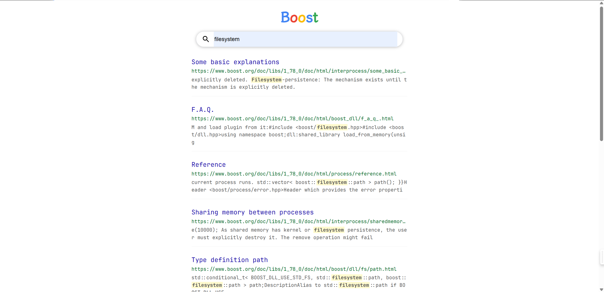
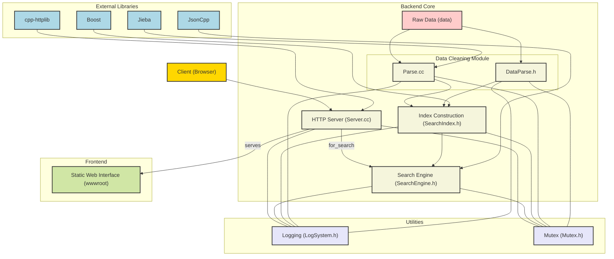

# BoostSearchingEngine

## 简介

本项目是基于C++扩展库Boost的搜索引擎项目，主要目的是了解站内搜索基本原理

## 资源准备

1. 后端：C++、[cpp-httplib开源库](https://github.com/yhirose/cpp-httplib)、[Jieba分词](https://github.com/fxsjy/jieba)、[Jsoncpp](https://www.help-doc.top/%E5%85%B6%E5%AE%83/%E5%85%B3%E4%BA%8EJSONCPP%E5%BA%93/%E5%85%B3%E4%BA%8EJSONCPP%E5%BA%93.html#jsoncpp)
2. 前端：HTML、CSS和JavaScript
3. 搜索内容：[1.78版本的Boost库](https://archives.boost.io/release/1.78.0/source/)中的`doc/html`中的内容。也可以到[数据源链接](https://github.com/H0308/Boostv1.78)下载
4. 日志：在Linux下实现的[日志系统](https://www.help-doc.top/Linux/19.%20Linux%E7%BA%BF%E7%A8%8B/6.%20%E6%97%A5%E5%BF%97%E7%B3%BB%E7%BB%9F/6.%20%E6%97%A5%E5%BF%97%E7%B3%BB%E7%BB%9F.html#_1)

> 当前项目仓库中不包含用于搜索的Boost库完整内容

## 使用

```shell
git clone https://github.com/H0308/BoostSearchingEngine.git
cd BoostSearchingEngine
make
./server 自定义端口号
```

> 运行之前需要先检查环境和依赖，对于软链接需要自行配置。需要注意，如果系统是CentOS，可能会因为gcc/g\+\+版本不足导致无法正常编译或者运行，请自行升级gcc/g\+\+

## 文件

- `Parse.cc`与`DataParse.h`：数据清洗模块
- `SearchIndex.h`：构建索引模块
- `SearchEngine.h`：搜索引擎模块
- `Server.cc`：服务端模块

## 运行示例

主页：


搜索：



404：


## 项目结构图


> 上图由[GitDiagram](https://gitdiagram.com/)提供
